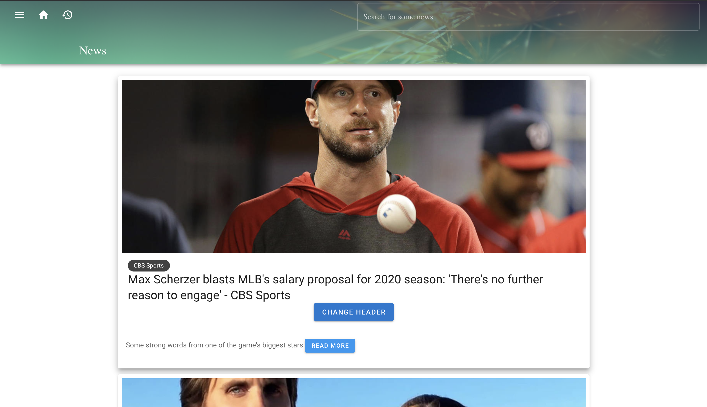
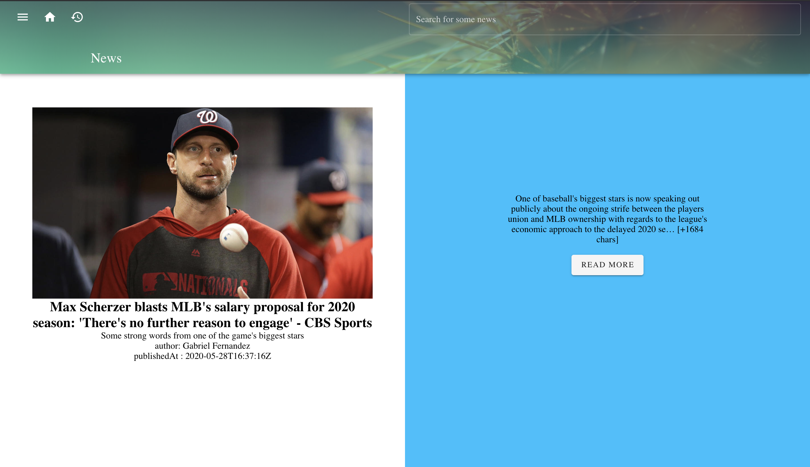
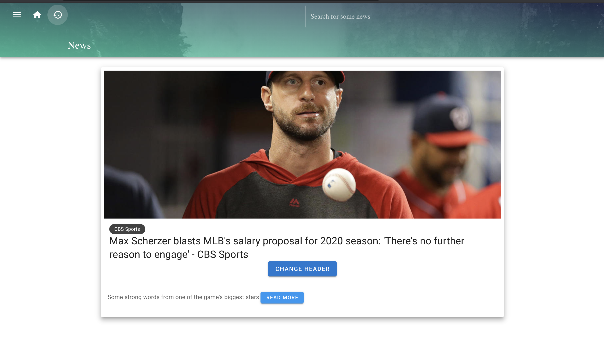
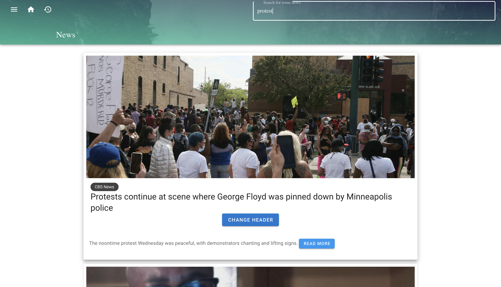
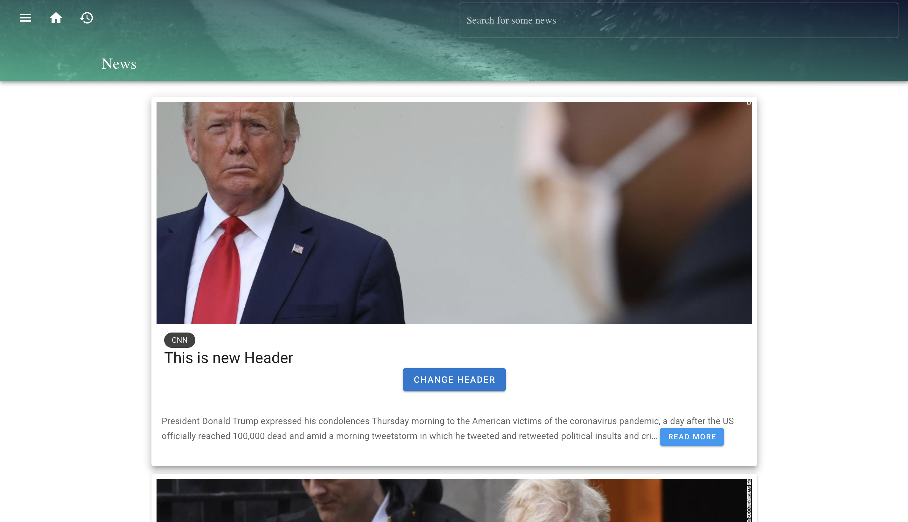

# manatal_test

## Project setup
```
yarn install
```

### Compiles and hot-reloads for development
```
yarn serve
```

### Compiles and minifies for production
```
yarn build
```

### Lints and fixes files
```
yarn lint
```

### Instruction & Screen shot of the project

This is the first page of the project.


You can click at READ MORE to get more information about a specific article.


The visited articles will be show in history page that you can click at the history icon and also for coming back to home page you can click at home icon at NavBar.  


You can filter the articles by a source with side-menu.
Note! You can only get the articles that already in the page at the initial time.


You can search for some articles by using the search-bar in the Nav-bar.


You can change the header of any articles by click at CHANGE HEADER button below each headers.


